<p align="center">
  <a href="https://chrome.google.com/webstore/detail/marshome/dikaddifgkonkicimbgikbcbaagajjhj"></a>

  **Share on:** <a href="https://news.ycombinator.com/submitlink?u=https://github.com/MarsAtHome/marsjs&t=Labeling Unsplash.com photos using Tensorflow.js in your browser"></a>
  <a href="https://twitter.com/home?status=Using%20Deep%20Learning,%20Label%20Unsplash.com%20photos%20with%20Tensorflow.js%20in%20your%20browser%3A%20https%3A//github.com/MarsAtHome/marsjs"></a>
</p>

# Marsjs - Using Tensorflow.js & Crowd Computing to label Unsplash photos in browser

Marsjs is the browser client for Mars@Home. Currently this extension labels image from [Unsplash](https://unsplash.com) in browser - using MobileNet on Tensorflow.Js. Install [Mars@Home from Chrome Store](https://chrome.google.com/webstore/detail/marshome/dikaddifgkonkicimbgikbcbaagajjhj)

## Non-Developer quickstart
Install [Mars@Home for Google Chrome](https://chrome.google.com/webstore/detail/marshome/dikaddifgkonkicimbgikbcbaagajjhj)

## Developer quickstart

Clone this project

```
$ git clone https://github.com/MarsAtHome/marsjs
```

### Project Structure

* [`captioner`](./captioner): Contains MobileNet & TensorflowJs code for Image Labeling
* [`extension`](./extension): Contains code of Chrome Extension
* [`images`](./images): Screenshots & media files for the README
* [`logo-files`](./logo-files): Logo files for [Mars@Home](https://github.com/MarsAtHome/)


#### In Firefox
1. Go to `about:debugging` in Firefox

2. Click `Load Temporary Add-on`, select any file from inside `extension` folder from cloned project

#### In Chrome
1. Go to `chrome://extensions/` in Chrome

2. Turn ON `Developer mode`

3. Click `LOAD UNPACKED` and select the `extension` folder from cloned project

**Check the Current task by clicking  in your browser's url bar**

## Model (MobileNet)
Taken straight from [tfjs-converter](https://github.com/tensorflow/tfjs-converter/tree/master/demo/mobilenet) MobileNet model is served from Google Cloud as 4MB chunks and is cacheable by browser.

The model takes 224x224 image, so Unsplash images are fetched in 224x224 size with `crop=face` URL parameter.

After changing files in `captioner/mobilenet/`, run

```
$ cd captioner
$ rmdir dist; # OR rm -rf dist
$ parcel build mobilenet/index.html
```

[Parcel](https://parceljs.org/) must be installed globally.

Copy all files except `index.html` from `dist` to `extension` directory. Copy the content of `dist/index.html` and paste it in `extension/popup.html` title & subtitle. Remove old code pointing to old build after pasting.

## Design

On clicking  the extension appears as a box of 300x600. Shows the link to current photo being processed. Once the labels assigned, shows top 3 labels with their Confidence score on the left.

<p align="center">
  
</p>

## Few Examples of Image Labeling

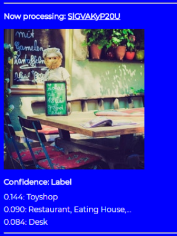 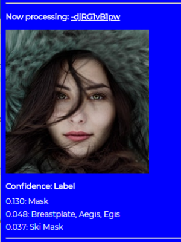 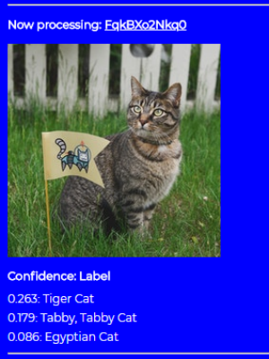

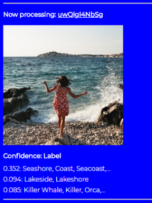 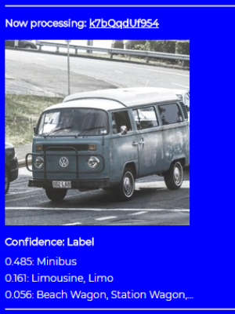 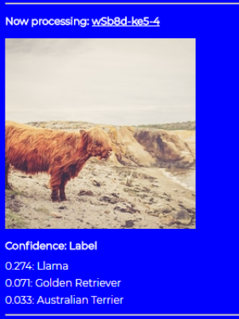

## Why image labeling?
[Mars@Home](https://marsathome.org/) says it's a public volunteer computing project committed to solving real life problems. Then why the first client labels images instead of ["computing climate simulations"](https://marsathome.org/faqs.html)? 

With this first version, we want to find out that *would people participate in a modern volunteer computing project for real life problems*? Keeping that in mind, we designed it so that, with other things, it has a small fun element to it. We wanted maximum people and developers to join the movement. Because the real development is yet to happen!

<hr>

### BTW I have to confess that building this project was such a joy! But watching the MobileNet model assign labels to beautiful Unsplash photos was equally entertaining. So here's more

<hr>

 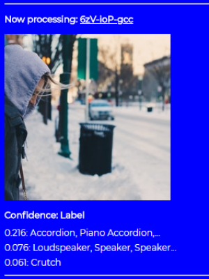 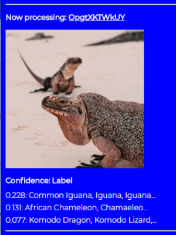

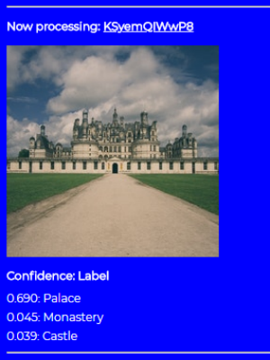 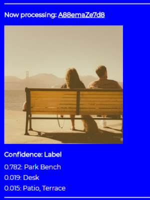 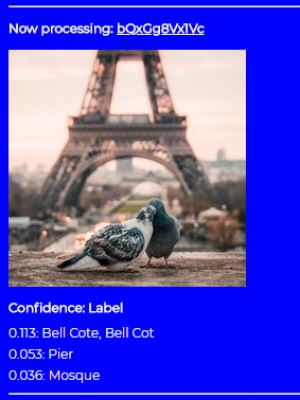

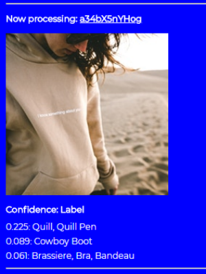  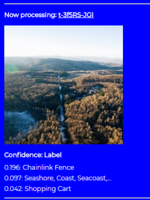

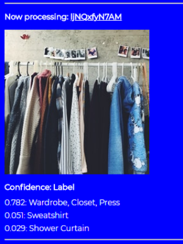 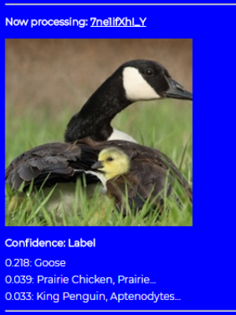 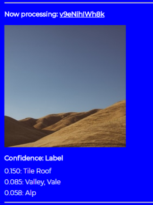

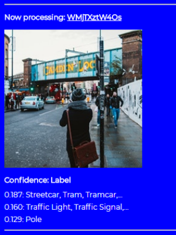 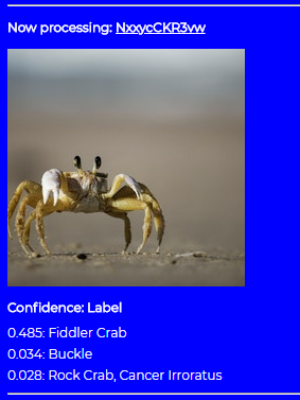 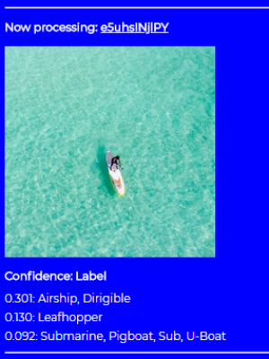

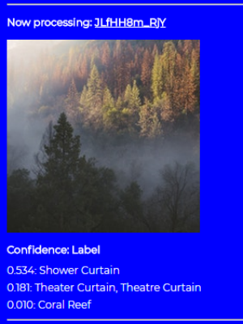 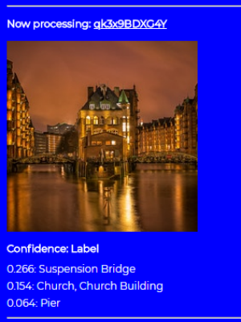 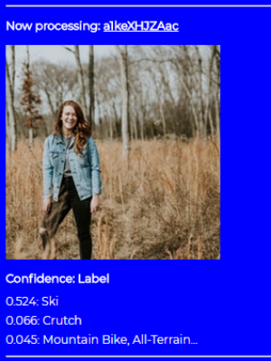

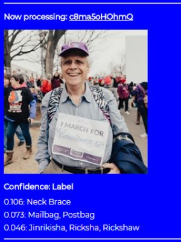 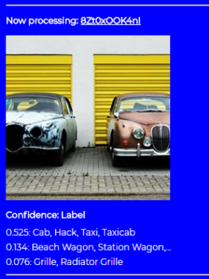 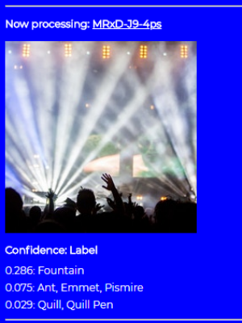

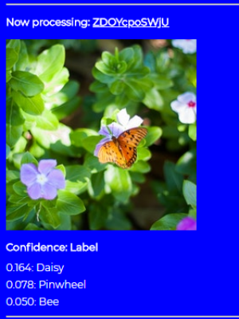 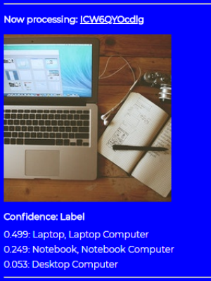 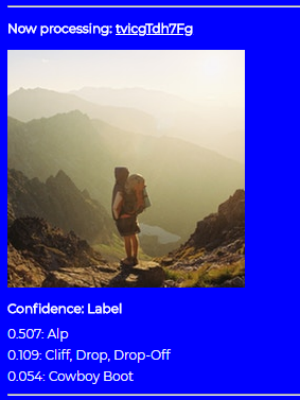

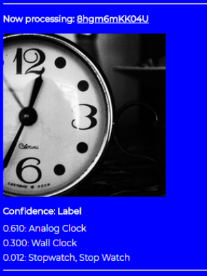 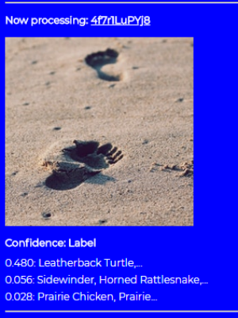 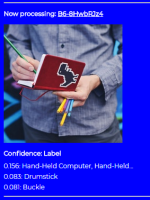

## Libraries & Model used

* [Tensorflow.js](https://github.com/tensorflow/tfjs)
* [TFJS Converter](https://github.com/tensorflow/tfjs-converter)
* [MobileNet Ported to Tensorflow.js](https://github.com/tensorflow/tfjs-converter/tree/master/demo/mobilenet)

## Learn more about Mars@Home project
* Star this repository :)
* Do visit → https://marsathome.org
